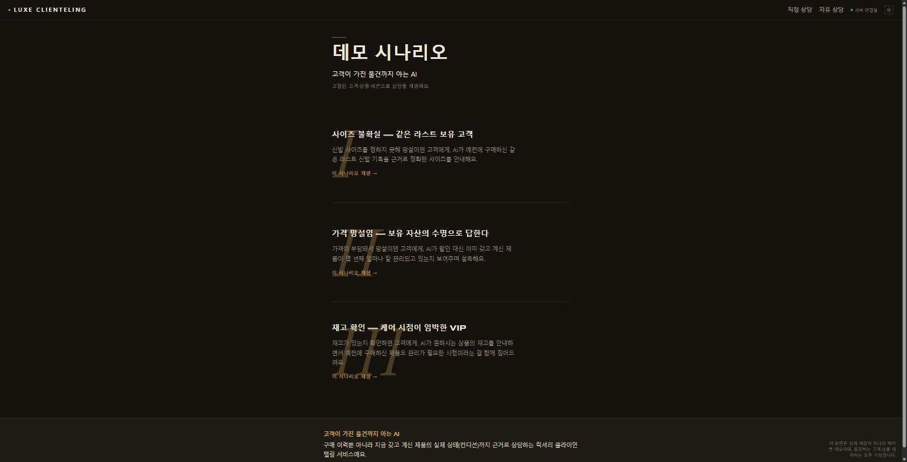
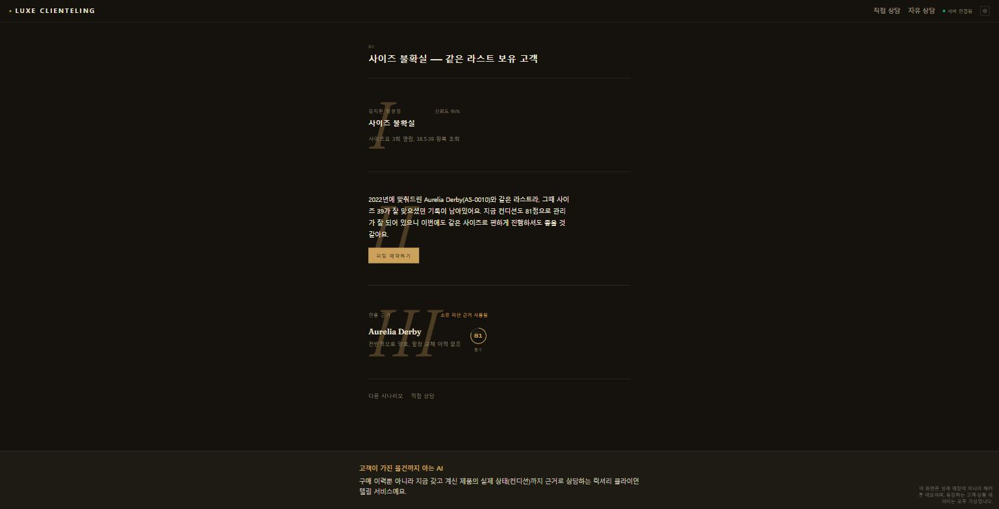
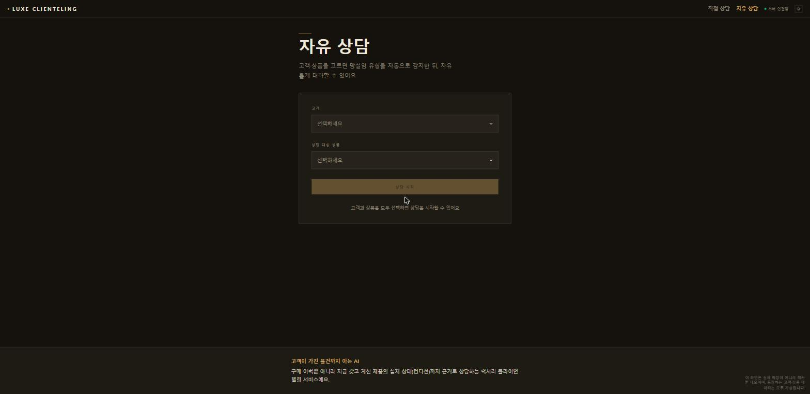
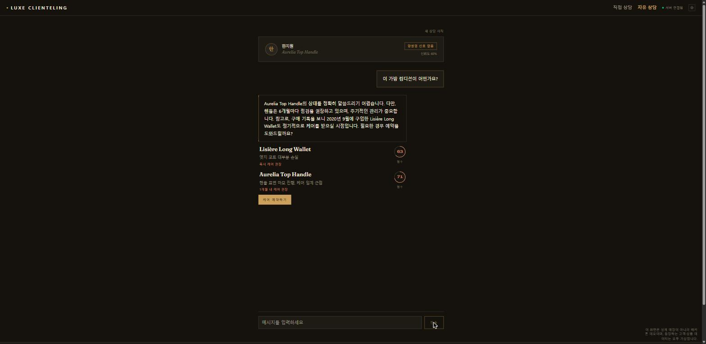

# Luxe Clienteling

> 소유 자산의 실제 상태로 상담하는 럭셔리 AI 클라이언텔링

고객을 아는 AI가 아니라, 고객이 가진 물건까지 아는 AI입니다. 구매 이력이 아니라
실제 소유 자산의 컨디션을 근거로 상담합니다.

## Live Demo
- 배포 URL: http://1.201.117.108/
- 고정 시나리오 3종(D1/D2/D3) 재생과 자유 상담 모두 지원합니다.

## Screenshots

| | |
|---|---|
|  데모 시나리오 목록(`/`) |  상담 결과 — 소유 자산 인용(`/result`) |
|  자유 상담 설정(`/chat`) |  자유 상담 대화 — 근거 카드 포함 |

## Key Features
- **Intent Sensing** — 세션 신호로 망설임 유형(사이즈/가격/취향/재고) 자동 감지
- **AI Clienteling Agent** — 소유 자산의 실제 상태를 근거로 한 실시간 GPT 상담
- **자유 상담** — 고객·상품을 자유롭게 선택해 여러 턴에 걸쳐 대화

## Tech Stack
- Frontend: React, Vite, Tailwind CSS
- Backend/통합레이어: FastAPI
- AI: OpenAI GPT (클라이언텔링), 규칙 기반 분류(Intent)
- Infra: Rocky Linux, nginx, systemd, Gabia Cloud

## Architecture

4개 계층으로 나뉩니다.

1. **Frontend** — React + Vite. 상담 화면, 소유 자산 근거 카드, CTA 렌더링을 담당합니다.
2. **통합/데모 레이어(오케스트레이터)** — FastAPI, 레포 루트. 인텐트 조회 → 자산 조회 →
   컨디션 우선 정렬 → 상담 호출 → 인용 검증의 5단계로 `/session/advise` 를 서빙하고,
   모듈별 Mock/HTTP 어댑터 전환과 LLM 예산·캐시 게이트웨이를 관리합니다.
3. **AI 1 · AI 2** — AI 1(인텐트 분류)은 세션 신호로 망설임 유형을 판정하고,
   AI 2(클라이언텔링)는 소유 자산의 실제 상태를 근거로 상담 응답을 생성합니다.
   둘 다 통합 레이어와 HTTP 어댑터로 연결됩니다.
4. **Infra** — Rocky Linux 기반 Gabia Cloud 서버. nginx 리버스 프록시 + systemd 로
   각 컴포넌트를 상시 구동합니다.

데이터 흐름: 고객 발화 → Frontend → 통합 레이어(인텐트 → 자산 → 랭킹) →
AI 2 상담 응답(소유 자산 인용 포함) → Frontend 근거 카드 렌더링.

## Team
무한도전 · 순천향대학교

---

| 파트 | 위치 | 문서 |
|---|---|---|
| 통합/데모 레이어 (오케스트레이터·목 어댑터·LLM 게이트웨이·Persona Bot Lab) | 리포 루트 (`app/`, `contracts/`, `fixtures/`, `config/`, `scripts/`, `tests/`) | [`docs/INTEGRATION.md`](docs/INTEGRATION.md) · [`docs/HANDOFF.md`](docs/HANDOFF.md) |
| 백엔드 (계약 엔드포인트 + 레거시 호환) | `backend/` | [`backend/README.md`](backend/README.md) |
| AI 1 — 인텐트 분류 (망설임 유형) | `AI/` | 노트북(`AI/AI1_intent_classify.ipynb`)만 있고 별도 문서는 없음. **실 데모는 이 코드가 아니라 통합 레이어의 규칙 기반 목업(`app/intent_rules.py`)이 담당** — 전환은 `INTENT_ADAPTER` env 로만 한다 |
| AI 2 — 클라이언텔링 (상담 에이전트) | `ai-clienteling/` | [`ai-clienteling/README.md`](ai-clienteling/README.md) · [`ai-clienteling/HANDOFF.md`](ai-clienteling/HANDOFF.md) · [`ai-clienteling/DESIGN.md`](ai-clienteling/DESIGN.md) |
| 프론트엔드 | `frontend/` | Vite 템플릿 기본 문서(`frontend/README.md`)뿐 — 실제 화면 구성은 `frontend/src/` 참고 |

## 통합 레이어 빠른 시작

```bash
make setup      # uv venv(3.11) + 의존성 + .env
make check      # ruff + mypy + 시드 픽스처 검증
make dev        # 서버 :8000 (목 모드)
```

- 팀 인터페이스(6개 엔드포인트): [`docs/CONTRACTS.md`](docs/CONTRACTS.md)
- 기존 백엔드 API 와의 필드 매핑: [`docs/BACKEND_INTEGRATION.md`](docs/BACKEND_INTEGRATION.md)
- 발표 당일 절차: [`docs/DEMO_RUNBOOK.md`](docs/DEMO_RUNBOOK.md)
- **이어받아 작업하는 사람은 [`docs/HANDOFF.md`](docs/HANDOFF.md) 를 먼저 읽는다.**

### 알아둘 제약 (확정)

1. **대회 API 는 텍스트 전용이다(비전 모델 없음).** 이미지 입력을 전제한 설계를 하지 않는다.
   컨디션 이미지 채점은 백엔드가 고전 CV 로 구현하며 계약은 그대로다.
2. **크레딧 총액 100달러, 초과 시 복구 불가.** 모든 LLM 호출은 `app/llm/` 게이트웨이를 지나고
   용도 태그를 갖는다. 하드 리밋 85달러를 넘길 호출은 실행 전에 거부된다.
   Lab 실행 전에는 `make estimate` 로 비용을 확인한다.

